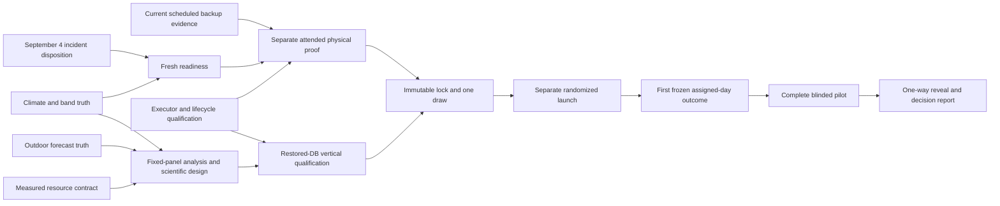

# Greenhouse evidence campaign — implementation strategy

The outcome is a safe, completed and interpretable bounded AI-admission pilot, followed by an explicit decision about further control and measured resource work. It is not a promise that AI wins. The full product objective—better climate with less gas, electricity and water—remains the north star, but the current meters and cooling/wetting-only treatment cannot establish that entire claim.

This campaign replaces the conflicting June lane plan and August launch-first sequencing. [backlog.yaml](backlog.yaml) is the authoritative structured plan; [GitHub campaign #775](https://github.com/VerdifyConsultancy/verdify-platform/issues/775) is its execution roll-up. Every one of the 68 issues open at the September 5 snapshot is rewritten, and ten missing outcomes are added. Closed history, original issue bodies, comments, unrelated working changes and existing PRs are preserved. This sprint changes planning and tracker state only: no application image, cluster setting, device, random draw or experiment activation.

## Architecture and scientific decision

Keep the deterministic on-device safety/controller and bounded AI supervisor. Reuse the merged component executor, 48-field grid/receipt contract, append-only experiment ledger, selector/lifecycle/freezer and once-only randomization. Do not begin a platform-v2 rewrite, an OTA prerequisite, a PID arm or a new hardware procurement campaign to unblock this study.

The default study option is the previously accepted 30-pair/60-local-day **exploratory pilot**, with its low modeled joint advance power of 0.13776 stated prominently. Jason's waivers of timed shadow, canary and A/A prerequisites remain effective. An 80% power gate is not quietly reinstated. A confirmatory redesign requires a justified prospective decision, empirical power and coherent source changes before lock; the current planning acceptance is not authority to change a locked protocol.

A remains the frozen FSM profile. B admits one daily AI choice among the same bounded baseline/moderate/aggressive profiles. Both arms make the virtual AI call; 11 cooling/wetting fields may differ and the other 37 remain constant. Current source pins Luna/medium; do not resurrect Sol prose, old provider identities or stale start dates. Common inference means this trial does not randomize compute cost.

The current B−A upper one-sided 97.5% bounds test VPD-distance noninferiority below +0.05 kPa, temperature-distance noninferiority below +0.50°F, and lower nine-stream active/open-state minutes. This is not a test of improved climate plus whole-resource savings. The scientific-design issue must choose and name the claim, eligible measured scope, fixed sensor panel/targets, outcome window, missingness, safety and season before any draw.

## Critical path and release bundles

The [complete graph](DEPENDENCIES.md) includes all 78 nodes and every native blocked-by edge. Parent/sub-issue relationships are ownership, not prerequisites. A task closes on its bounded evidence, so executor qualification does not wait for randomized day 1 while day 1 waits for the executor. Physical conditions, exact authority and external fleet/monitoring interfaces remain explicit issue requirements, not fabricated dependency nodes.

| Bundle | Implementation boundary | Exit evidence |
|---|---|---|
| A — C0 data truth | Forward DB contract, typed consumers, public/planner semantics; independent incident and resource/forecast analyses | Hand-computed regression cases, current source-bound probes, immutable input/output hashes, honest missingness |
| B — C1 safe qualification | Existing executor/lifecycle fault matrix, current readiness/recovery and restored-data vertical path; no generalized transport | Real restore and SQL/role/setter-schema/export/analyzer receipt; one separately authorized physical baseline→aggressive→baseline proof |
| C — C2 design/start | Coherent pre-draw calendar/design/source artifacts, provider preflight, one lock/draw and exact launch packet | Immutable commitment, separate launch decision, actual assignment/two-epoch exposure and current Argo/runtime receipt |
| D — C3 run/readout | Daily blinded reconciliation, all assigned days, final freeze and restricted reveal | Reproducible ITT result, prespecified bounds/inconclusive handling, safe final state and next decision |
| E — C4 delivery/runtime | Path-aware exact-SHA validation, real compile, truthful writer/planner and loaded alerts | Negative tests plus actual deployment/data/action/alert recovery, not static readiness |
| F — C5 durability | Real role-complete backups, supported compressed-chunk restore, durable spool, alongside HA | Measured restore/failover/PITR and data-loss boundaries; live cutover stays separate |
| G — C6–C8 follow-through | Evidence-led control/irrigation, physical commissioning, comparator/economics or future platform | Explicit go/no-go and separately scoped implementation; no automatic expansion of current study |

Use one PR per coherent release boundary, not one PR or image build per issue. C0 analysis and independent C1 device-denied qualification can overlap. Serialize shared migrations, writer changes and physical authority transitions. Estimates in [SPRINTS.md](../SPRINTS.md) are engineering ranges, not promised calendar dates. The retained pilot itself takes 60 local days; do not hide that duration inside a short sprint estimate.

## First pull order

1. Rebaseline current source, desired/running digests, applied migration ledger, writer generation, backup artifact and actual Argo state through the authorized evidence path. September 5 public health and a successful scheduled backup are useful observations, not a current private-ledger or Synced/Healthy proof. Preserve PR #776 and draft #774; review/rebase only relevant hunks during implementation, never merge stale runtime pins wholesale.
2. Pull independent C0 work: #371 metric semantics, #424 band lineage, September 4 incident timeline, outdoor forecast truth and resource eligibility. Fixed-panel historical reanalysis follows the truthful metric definition. The scientific-design issue consumes those empirical outputs.
3. Qualify #639/#587 against current code, prepare #749 and close the fresh #747 acceptance. Execute already-authorized Gate R only if the current orphan state requires it, with exact bounded binding and no proof credit. Retire its authority immediately.
4. Obtain the separate fresh Gate P decision and perform #641's attended proof. Run the restored-data integration against the chosen pre-draw scientific contract. These independent evidentiary strands meet at #588; do not call unit tests a real DB/device proof.
5. Lock/finalize once, obtain the separate #642 launch decision, verify actual day 1, freeze #640, then operate and read out the entire pilot. No stage closes merely because its source merged.

## Measurement and analysis contract

Physical crop exposure is primary: target/version, binary joint and each-axis compliance, distance outside bounds, high/low severity, worst measured zone and sample eligibility. Controller-attributable/feasibility credit is a separate diagnostic. A score of 85.8 can coexist with legacy joint in-band 6.1%; neither may be relabeled as the other. Desired `setpoint_changes`, stale snapshots and generated defaults are not device-consumed truth.

Fix the north/east/west panel for the historical sensitivity and selected study; identify contributor IDs and missingness. A safety quorum of three probes is different from a scientifically complete fixed panel. South repair may be safe maintenance but cannot silently change the endpoint. No center/canopy/leaf-wetness claim is supported by a house-average proxy.

Forecast error compares an as-of outdoor forecast with observed outdoor truth at the correct lead. Indoor response is a separate modeled/measured quantity. Preserve original extraction dates and hashes when public rollups change.

Resource accounting names exact meter/circuit/stream, calibration, uncertainty, sampling interval, reset epoch and attribution class. Climate mist, irrigation/fertigation, manual and ambiguous water stay separate. Partial measured electricity and whole-equipment modeled electricity have different scopes. Vent-open time is not motor runtime. Missing gas, cost, interior DLI and crop yield remain unavailable. A narrow runtime pilot is allowed, but cannot claim energy/water/economic improvement.

Recompute power using the actual 06:00–24:00 18-hour endpoint and replayed selector admission/fallback, not a 22-hour scale and assumed reliability. Under the existing all-pairs rule, 99% pair completeness yields about 74.0% probability of retaining all 30 pairs; 95% yields about 21.5%. Explicitly evaluate season/carryover and plausible effects. The current November 2 calendar avoids a clock-change crossing but mismatches a hot/dry treatment; choose a justified future window or narrow winter question before lock. The fall transition does not itself make 06:00–24:00 longer than 18 elapsed hours.

Assignment determines ITT row existence. Failed delivery, fallback, rescue, zero exposure and null data remain assigned. Exposure is fidelity/per-protocol information, never a primary inclusion filter. Do not redraw, replace days, shift windows, impute after reveal or revise the denominator. A null required pair triggers the frozen inconclusive/bounds rule if that rule is retained. Freeze outcomes/deviations/fidelity/environment before one-way reveal; publish adverse or inconclusive results as readily as favorable ones.

## Validation and delivery strategy

For this planning sprint: validate full original-issue coverage, nonempty what/why/how/acceptance, actual source paths, unique numbers, complete references, blocking and hierarchy DAGs, no umbrella deadlocks, deterministic rendering and GitHub body/metadata/dependency/parent readback. Snapshot issue bodies/labels/milestones/parents/edges before writes and refuse to overwrite concurrent body/metadata changes. Preserve old closed child #676 as history.

For implementation: run the relevant current `.agent-fleet/ci.yaml` checks and repository targets. Add specific SQL hand calculations and forward-migration rollback tests, research design/outcome/selector goldens, real restored-data allow/deny tests, native/invariant/band/outdoor replay, and actual ESPHome compilation where relevant. Test negative cases through the same harness as positive ones. Broad existing baseline failures are reported separately, never suppressed to make a campaign green.

Build only changed registered runtime inputs, using in-cluster Kaniko into Zot origin. Pin verified digests in declarative source and use the owning Argo path without prune. The generated fleet contract is changed in its owning registry, not by editing the mirror. Final runtime completion means exact source/config/running image adoption, Synced + Healthy and current data/action evidence. This release changes only top-level planning views, planning tooling and a Make target, so it requires no application build or cluster sync. Do not generalize that to all documentation: `docs/` is copied into ingestor for RAG/playbook use, and `site/docs` affects the publisher. Metadata-only Git SHA changes do not imply every image must be rebuilt.

## Authority, rollback and stop conditions

Planning approval does not activate a physical experiment. Gate R was already authorized subject to its exact current recovery binding. Gate P and later randomized launch are separate exact decisions. Hardware installs, firmware OTA and live DB cutover keep their actual bounded physical/release windows. Routine read-only work, tests and scoped source delivery need no invented blanket approval gate. No unsolicited credential rotation.

Preserve prior source/digests/config/data and failed attempts before implementation. Applied migrations are immutable; repair forward. Experiment ambiguity closes exposure and revokes nonbaseline first, yields to manual/emergency rescue, and allows only facility-authorized linked baseline/full-48 recovery. Two fresh confirming epochs precede normal disable/ID clear and ordinary-writer restoration. An explicitly recorded facility-owned emergency-safe closure must not be called confirmed baseline.

Stop or hold for real sensor/quorum/semantic contradictions, stale work, generation mismatch, writer collision, unconfirmed recovery or unclassified safety conditions. Do not relax caps to explain September 4's flat counter. During the study, urgent safety repairs take precedence, but trigger the preregistered deviation/abort handling instead of silently changing treatment identity.

DB cutover must fence all mutators. Reverting DB_HOST after new-primary writes is not inherently lossless; prove a pre-write rollback boundary and a post-write reverse-sync/forward-recovery strategy. Never dump password-bearing globals into public artifacts. Keep old database/PVC and firmware last-good recovery artifacts through their measured bake/retention criteria.

## Definition of over the line

The core evidence campaign is complete when a qualified pilot has either completed or reached its prespecified safe stopping boundary, every assigned day is retained, the frozen analysis is reproduced and a decision report states exactly what is and is not supported. C4–C8 remain explicitly owned follow-through, not a claim that all future platform and hardware work is finished. Broader epics close only on child evidence or an explicit recorded scope/disposition decision; the root does not falsely close deferred work.

The next step may be no further AI control, a measurement/reliability repair, a better-powered repeat, a deterministic forecast-selector comparison, or a separately commissioned heating/resource study. The completed pilot determines which—not a presumption that more sophistication must follow.
