# Complete blocking dependency graph

Generated from [backlog.yaml](backlog.yaml). An arrow means **predecessor must finish before dependent acceptance/activation**, not parentage. Isolated nodes are included so coverage is auditable. Read [CAMPAIGN.md](CAMPAIGN.md) for the smaller critical path.

```mermaid
flowchart TD
  subgraph C0["C0: Measurement and incident truth"]
    i775["#775 Campaign: trustworthy greenhouse outcomes → qualified pilo"]
    i778["#778 Investigate September 4 hot/dry peak and three-hour wettin"]
    i371["#371 Repair climate score semantics and publish physical outcom"]
    i424["#424 Resolve served, consumed and raw-readback band lineage wit"]
    i779["#779 Re-run historical planner comparisons on a fixed sensor pa"]
    i780["#780 Score as-of outdoor forecasts against outdoor truth and se"]
    i781["#781 Commission a claim-safe water and electricity endpoint con"]
    i782["#782 Choose a season-appropriate exploratory pilot and freeze t"]
  end
  subgraph C1["C1: Recovery and integrated physical qualification"]
    i750["#750 Recovery/proof campaign: rebaseline current state and seal"]
    i747["#747 Verify corrected scheduled backups and current production "]
    i749["#749 Qualify current three-probe readiness and explicit safety "]
    i641["#641 Execute authorized orphan recovery and one separately atte"]
    i639["#639 Qualify the existing component executor and full-state rec"]
    i587["#587 Qualify fail-closed lifecycle, kill switch and blinded ope"]
    i783["#783 Prove restore → selector → setter schema → receipt → froze"]
  end
  subgraph C2["C2: Seasonal design lock and randomized start"]
    i581["#581 Experiment program: qualify, run and read out the bounded "]
    i588["#588 Lock the qualified pilot identity and finalize exactly one"]
    i642["#642 Authorize and verify one randomized day-1 activation from "]
  end
  subgraph C3["C3: Complete pilot and decision report"]
    i640["#640 Freeze the first assigned-day ITT outcome and blinded repr"]
    i784["#784 Operate the complete blinded pilot and preserve every assi"]
    i785["#785 Reveal once, reproduce the frozen analysis and publish the"]
  end
  subgraph C4["C4: Delivery and runtime reliability"]
    i644["#644 Integrate exact-SHA, path-aware and device-safe delivery r"]
    i322["#322 Replace remaining VM-era tests with current k3s delivery c"]
    i304["#304 Provide reproducible least-authority firmware and database"]
    i303["#303 Run real portable ESPHome compilation for declared firmwar"]
    i390["#390 Gate firmware releases on topology, cycling, runtime safet"]
    i433["#433 Finish truthful single-writer command lifecycle and no-rec"]
    i427["#427 Prove active Hermes/MCP recovery and truthful non-authorit"]
    i75["#75 Observability program: prove actionable health from source"]
    i563["#563 Enforce the actual ConfigMap-based alert delivery contract"]
    i394["#394 Deliver and fault-test live split-brain and no-writer aler"]
    i89["#89 Verify exact-source post-deploy smoke and device-route hea"]
    i671["#671 Make Lab publishing failures and cache contention observab"]
    i399["#399 Prove the HA grow-light writer remains within the single-w"]
    i419["#419 Populate real outdoor freshness in replay and enforce bran"]
    i386["#386 Prove grow-light minimum-on behavior at the solar-window b"]
  end
  subgraph C5["C5: Durability and least privilege"]
    i218["#218 Durability program: recoverable backups, measured RPO/RTO "]
    i670["#670 Make backup artifacts sufficient to restore roles, ownersh"]
    i672["#672 Make compressed-chunk ownership restoration a supported bl"]
    i382["#382 Persist ingestor queue and spool across restart and node l"]
    i396["#396 Design and rehearse CNPG alongside the live database on cu"]
    i245["#245 Execute a separately bounded database cutover only after p"]
    i643["#643 Extend least-privilege database roles beyond the already-r"]
    i49["#49 Audit and close historical suppressed sensor alerts withou"]
  end
  subgraph C6["C6: Evidence-led control and irrigation"]
    i359["#359 Control program: truthful crop corridors before evidence-l"]
    i430["#430 Simplify firmware only while preserving autonomous control"]
    i428["#428 Diagnose heap/watchdog risk and qualify the actual last-go"]
    i368["#368 Define shared sensor jump, flatline and contributor-integr"]
    i367["#367 Consolidate anti-chatter into one explicit dwell contract"]
    i370["#370 Consolidate equipment conflict resolution into one pure ar"]
    i369["#369 Remove dead tunables and code from a verified consumer inv"]
    i324["#324 Extend zonal band lineage compatibly for future determinis"]
    i410["#410 Measure realized solar-night dry-out before changing the c"]
    i378["#378 Decide corridor widths from fixed-target crop and resource"]
    i361["#361 Reassess diurnal anchors only after solar parity and measu"]
    i214["#214 Prove crop-deviation trigger → valid plan on the sole oper"]
    i350["#350 Irrigation program: topology truth, overwatering protectio"]
    i434["#434 Enforce center-only climate mist and commissioned wall-onl"]
    i299["#299 Preserve center-mister re-fire protection through topology"]
    i297["#297 Add saturation alerts and a commissioned dispatcher-side d"]
    i296["#296 Consider slow-hysteresis firmware irrigation feedback only"]
  end
  subgraph C7["C7: Physical and seasonal commissioning"]
    i16["#16 Hardware program: commission only the sensing and equipmen"]
    i751["#751 Replace the failed south climate probe and diagnose hydro "]
    i298["#298 Rebaseline actual crop, pot and probe topology before feed"]
    i398["#398 Replace stale soil threshold seeds with commissioned crop/"]
    i45["#45 Commission soil and runoff feedback before enabling irriga"]
    i51["#51 Calibrate CO2 against a real reference and publish measure"]
    i52["#52 Define species-appropriate seasonal dormancy care from ope"]
    i412["#412 Close the seasonal door screen only when measured night co"]
  end
  subgraph C8["C8: Comparator and full resource claim"]
    i174["#174 Rehome only current Verdify admin surfaces to global SSO, "]
    i14["#14 Twin program: qualify declared oracle coverage before usin"]
    i31["#31 Close twin setpoint and actuator coverage gaps with genera"]
    i606["#606 Register the twin build profile only through its owning fl"]
    i638["#638 Unify future manifest/vector wire schema and content ident"]
    i586["#586 Qualify a future atomic firmware policy engine with crash-"]
    i786["#786 Design the next comparison against a deterministic forecas"]
    i379["#379 Gate grey-box forecasting and MPC on validated response mo"]
    i787["#787 Plan measured heating, overnight and whole-resource econom"]
  end
  i371 --> i779
  i424 --> i749
  i778 --> i749
  i747 --> i641
  i749 --> i641
  i639 --> i641
  i587 --> i641
  i371 --> i782
  i779 --> i782
  i780 --> i782
  i781 --> i782
  i639 --> i783
  i587 --> i783
  i782 --> i783
  i641 --> i588
  i782 --> i588
  i783 --> i588
  i588 --> i642
  i642 --> i640
  i640 --> i784
  i784 --> i785
  i304 --> i303
  i322 --> i303
  i303 --> i390
  i419 --> i390
  i433 --> i427
  i563 --> i394
  i563 --> i89
  i303 --> i386
  i670 --> i672
  i670 --> i396
  i672 --> i396
  i396 --> i245
  i382 --> i245
  i670 --> i643
  i433 --> i428
  i424 --> i368
  i390 --> i367
  i390 --> i370
  i367 --> i370
  i433 --> i369
  i390 --> i369
  i424 --> i324
  i371 --> i324
  i424 --> i410
  i371 --> i410
  i419 --> i410
  i371 --> i378
  i785 --> i378
  i378 --> i361
  i410 --> i361
  i427 --> i214
  i780 --> i214
  i390 --> i434
  i299 --> i434
  i390 --> i299
  i398 --> i297
  i45 --> i297
  i297 --> i296
  i434 --> i296
  i45 --> i296
  i298 --> i398
  i398 --> i45
  i638 --> i586
  i390 --> i586
  i785 --> i586
  i785 --> i786
  i780 --> i786
  i786 --> i379
  i419 --> i379
  i371 --> i379
  i785 --> i787
  i781 --> i787
  i410 --> i787
```

## Exact edge list

| Predecessor | Dependent |
|---|---|
| [#371](https://github.com/VerdifyConsultancy/verdify-platform/issues/371) | [#779](https://github.com/VerdifyConsultancy/verdify-platform/issues/779) |
| [#424](https://github.com/VerdifyConsultancy/verdify-platform/issues/424) | [#749](https://github.com/VerdifyConsultancy/verdify-platform/issues/749) |
| [#778](https://github.com/VerdifyConsultancy/verdify-platform/issues/778) | [#749](https://github.com/VerdifyConsultancy/verdify-platform/issues/749) |
| [#747](https://github.com/VerdifyConsultancy/verdify-platform/issues/747) | [#641](https://github.com/VerdifyConsultancy/verdify-platform/issues/641) |
| [#749](https://github.com/VerdifyConsultancy/verdify-platform/issues/749) | [#641](https://github.com/VerdifyConsultancy/verdify-platform/issues/641) |
| [#639](https://github.com/VerdifyConsultancy/verdify-platform/issues/639) | [#641](https://github.com/VerdifyConsultancy/verdify-platform/issues/641) |
| [#587](https://github.com/VerdifyConsultancy/verdify-platform/issues/587) | [#641](https://github.com/VerdifyConsultancy/verdify-platform/issues/641) |
| [#371](https://github.com/VerdifyConsultancy/verdify-platform/issues/371) | [#782](https://github.com/VerdifyConsultancy/verdify-platform/issues/782) |
| [#779](https://github.com/VerdifyConsultancy/verdify-platform/issues/779) | [#782](https://github.com/VerdifyConsultancy/verdify-platform/issues/782) |
| [#780](https://github.com/VerdifyConsultancy/verdify-platform/issues/780) | [#782](https://github.com/VerdifyConsultancy/verdify-platform/issues/782) |
| [#781](https://github.com/VerdifyConsultancy/verdify-platform/issues/781) | [#782](https://github.com/VerdifyConsultancy/verdify-platform/issues/782) |
| [#639](https://github.com/VerdifyConsultancy/verdify-platform/issues/639) | [#783](https://github.com/VerdifyConsultancy/verdify-platform/issues/783) |
| [#587](https://github.com/VerdifyConsultancy/verdify-platform/issues/587) | [#783](https://github.com/VerdifyConsultancy/verdify-platform/issues/783) |
| [#782](https://github.com/VerdifyConsultancy/verdify-platform/issues/782) | [#783](https://github.com/VerdifyConsultancy/verdify-platform/issues/783) |
| [#641](https://github.com/VerdifyConsultancy/verdify-platform/issues/641) | [#588](https://github.com/VerdifyConsultancy/verdify-platform/issues/588) |
| [#782](https://github.com/VerdifyConsultancy/verdify-platform/issues/782) | [#588](https://github.com/VerdifyConsultancy/verdify-platform/issues/588) |
| [#783](https://github.com/VerdifyConsultancy/verdify-platform/issues/783) | [#588](https://github.com/VerdifyConsultancy/verdify-platform/issues/588) |
| [#588](https://github.com/VerdifyConsultancy/verdify-platform/issues/588) | [#642](https://github.com/VerdifyConsultancy/verdify-platform/issues/642) |
| [#642](https://github.com/VerdifyConsultancy/verdify-platform/issues/642) | [#640](https://github.com/VerdifyConsultancy/verdify-platform/issues/640) |
| [#640](https://github.com/VerdifyConsultancy/verdify-platform/issues/640) | [#784](https://github.com/VerdifyConsultancy/verdify-platform/issues/784) |
| [#784](https://github.com/VerdifyConsultancy/verdify-platform/issues/784) | [#785](https://github.com/VerdifyConsultancy/verdify-platform/issues/785) |
| [#304](https://github.com/VerdifyConsultancy/verdify-platform/issues/304) | [#303](https://github.com/VerdifyConsultancy/verdify-platform/issues/303) |
| [#322](https://github.com/VerdifyConsultancy/verdify-platform/issues/322) | [#303](https://github.com/VerdifyConsultancy/verdify-platform/issues/303) |
| [#303](https://github.com/VerdifyConsultancy/verdify-platform/issues/303) | [#390](https://github.com/VerdifyConsultancy/verdify-platform/issues/390) |
| [#419](https://github.com/VerdifyConsultancy/verdify-platform/issues/419) | [#390](https://github.com/VerdifyConsultancy/verdify-platform/issues/390) |
| [#433](https://github.com/VerdifyConsultancy/verdify-platform/issues/433) | [#427](https://github.com/VerdifyConsultancy/verdify-platform/issues/427) |
| [#563](https://github.com/VerdifyConsultancy/verdify-platform/issues/563) | [#394](https://github.com/VerdifyConsultancy/verdify-platform/issues/394) |
| [#563](https://github.com/VerdifyConsultancy/verdify-platform/issues/563) | [#89](https://github.com/VerdifyConsultancy/verdify-platform/issues/89) |
| [#303](https://github.com/VerdifyConsultancy/verdify-platform/issues/303) | [#386](https://github.com/VerdifyConsultancy/verdify-platform/issues/386) |
| [#670](https://github.com/VerdifyConsultancy/verdify-platform/issues/670) | [#672](https://github.com/VerdifyConsultancy/verdify-platform/issues/672) |
| [#670](https://github.com/VerdifyConsultancy/verdify-platform/issues/670) | [#396](https://github.com/VerdifyConsultancy/verdify-platform/issues/396) |
| [#672](https://github.com/VerdifyConsultancy/verdify-platform/issues/672) | [#396](https://github.com/VerdifyConsultancy/verdify-platform/issues/396) |
| [#396](https://github.com/VerdifyConsultancy/verdify-platform/issues/396) | [#245](https://github.com/VerdifyConsultancy/verdify-platform/issues/245) |
| [#382](https://github.com/VerdifyConsultancy/verdify-platform/issues/382) | [#245](https://github.com/VerdifyConsultancy/verdify-platform/issues/245) |
| [#670](https://github.com/VerdifyConsultancy/verdify-platform/issues/670) | [#643](https://github.com/VerdifyConsultancy/verdify-platform/issues/643) |
| [#433](https://github.com/VerdifyConsultancy/verdify-platform/issues/433) | [#428](https://github.com/VerdifyConsultancy/verdify-platform/issues/428) |
| [#424](https://github.com/VerdifyConsultancy/verdify-platform/issues/424) | [#368](https://github.com/VerdifyConsultancy/verdify-platform/issues/368) |
| [#390](https://github.com/VerdifyConsultancy/verdify-platform/issues/390) | [#367](https://github.com/VerdifyConsultancy/verdify-platform/issues/367) |
| [#390](https://github.com/VerdifyConsultancy/verdify-platform/issues/390) | [#370](https://github.com/VerdifyConsultancy/verdify-platform/issues/370) |
| [#367](https://github.com/VerdifyConsultancy/verdify-platform/issues/367) | [#370](https://github.com/VerdifyConsultancy/verdify-platform/issues/370) |
| [#433](https://github.com/VerdifyConsultancy/verdify-platform/issues/433) | [#369](https://github.com/VerdifyConsultancy/verdify-platform/issues/369) |
| [#390](https://github.com/VerdifyConsultancy/verdify-platform/issues/390) | [#369](https://github.com/VerdifyConsultancy/verdify-platform/issues/369) |
| [#424](https://github.com/VerdifyConsultancy/verdify-platform/issues/424) | [#324](https://github.com/VerdifyConsultancy/verdify-platform/issues/324) |
| [#371](https://github.com/VerdifyConsultancy/verdify-platform/issues/371) | [#324](https://github.com/VerdifyConsultancy/verdify-platform/issues/324) |
| [#424](https://github.com/VerdifyConsultancy/verdify-platform/issues/424) | [#410](https://github.com/VerdifyConsultancy/verdify-platform/issues/410) |
| [#371](https://github.com/VerdifyConsultancy/verdify-platform/issues/371) | [#410](https://github.com/VerdifyConsultancy/verdify-platform/issues/410) |
| [#419](https://github.com/VerdifyConsultancy/verdify-platform/issues/419) | [#410](https://github.com/VerdifyConsultancy/verdify-platform/issues/410) |
| [#371](https://github.com/VerdifyConsultancy/verdify-platform/issues/371) | [#378](https://github.com/VerdifyConsultancy/verdify-platform/issues/378) |
| [#785](https://github.com/VerdifyConsultancy/verdify-platform/issues/785) | [#378](https://github.com/VerdifyConsultancy/verdify-platform/issues/378) |
| [#378](https://github.com/VerdifyConsultancy/verdify-platform/issues/378) | [#361](https://github.com/VerdifyConsultancy/verdify-platform/issues/361) |
| [#410](https://github.com/VerdifyConsultancy/verdify-platform/issues/410) | [#361](https://github.com/VerdifyConsultancy/verdify-platform/issues/361) |
| [#427](https://github.com/VerdifyConsultancy/verdify-platform/issues/427) | [#214](https://github.com/VerdifyConsultancy/verdify-platform/issues/214) |
| [#780](https://github.com/VerdifyConsultancy/verdify-platform/issues/780) | [#214](https://github.com/VerdifyConsultancy/verdify-platform/issues/214) |
| [#390](https://github.com/VerdifyConsultancy/verdify-platform/issues/390) | [#434](https://github.com/VerdifyConsultancy/verdify-platform/issues/434) |
| [#299](https://github.com/VerdifyConsultancy/verdify-platform/issues/299) | [#434](https://github.com/VerdifyConsultancy/verdify-platform/issues/434) |
| [#390](https://github.com/VerdifyConsultancy/verdify-platform/issues/390) | [#299](https://github.com/VerdifyConsultancy/verdify-platform/issues/299) |
| [#398](https://github.com/VerdifyConsultancy/verdify-platform/issues/398) | [#297](https://github.com/VerdifyConsultancy/verdify-platform/issues/297) |
| [#45](https://github.com/VerdifyConsultancy/verdify-platform/issues/45) | [#297](https://github.com/VerdifyConsultancy/verdify-platform/issues/297) |
| [#297](https://github.com/VerdifyConsultancy/verdify-platform/issues/297) | [#296](https://github.com/VerdifyConsultancy/verdify-platform/issues/296) |
| [#434](https://github.com/VerdifyConsultancy/verdify-platform/issues/434) | [#296](https://github.com/VerdifyConsultancy/verdify-platform/issues/296) |
| [#45](https://github.com/VerdifyConsultancy/verdify-platform/issues/45) | [#296](https://github.com/VerdifyConsultancy/verdify-platform/issues/296) |
| [#298](https://github.com/VerdifyConsultancy/verdify-platform/issues/298) | [#398](https://github.com/VerdifyConsultancy/verdify-platform/issues/398) |
| [#398](https://github.com/VerdifyConsultancy/verdify-platform/issues/398) | [#45](https://github.com/VerdifyConsultancy/verdify-platform/issues/45) |
| [#638](https://github.com/VerdifyConsultancy/verdify-platform/issues/638) | [#586](https://github.com/VerdifyConsultancy/verdify-platform/issues/586) |
| [#390](https://github.com/VerdifyConsultancy/verdify-platform/issues/390) | [#586](https://github.com/VerdifyConsultancy/verdify-platform/issues/586) |
| [#785](https://github.com/VerdifyConsultancy/verdify-platform/issues/785) | [#586](https://github.com/VerdifyConsultancy/verdify-platform/issues/586) |
| [#785](https://github.com/VerdifyConsultancy/verdify-platform/issues/785) | [#786](https://github.com/VerdifyConsultancy/verdify-platform/issues/786) |
| [#780](https://github.com/VerdifyConsultancy/verdify-platform/issues/780) | [#786](https://github.com/VerdifyConsultancy/verdify-platform/issues/786) |
| [#786](https://github.com/VerdifyConsultancy/verdify-platform/issues/786) | [#379](https://github.com/VerdifyConsultancy/verdify-platform/issues/379) |
| [#419](https://github.com/VerdifyConsultancy/verdify-platform/issues/419) | [#379](https://github.com/VerdifyConsultancy/verdify-platform/issues/379) |
| [#371](https://github.com/VerdifyConsultancy/verdify-platform/issues/371) | [#379](https://github.com/VerdifyConsultancy/verdify-platform/issues/379) |
| [#785](https://github.com/VerdifyConsultancy/verdify-platform/issues/785) | [#787](https://github.com/VerdifyConsultancy/verdify-platform/issues/787) |
| [#781](https://github.com/VerdifyConsultancy/verdify-platform/issues/781) | [#787](https://github.com/VerdifyConsultancy/verdify-platform/issues/787) |
| [#410](https://github.com/VerdifyConsultancy/verdify-platform/issues/410) | [#787](https://github.com/VerdifyConsultancy/verdify-platform/issues/787) |

Closed #676 remains historical qualification evidence, not an open blocker. Cross-repository fleet/monitoring delivery is a concrete implementation interface in the relevant issues, not a fabricated in-repository node. Physical windows and minimum live-state invariants remain explicit issue conditions.
