# Current full repository dependency receipt — October 6 UTC, 2026

This is the native readback of the85 campaign-source nodes plus independent#317/#801/#802. All campaign edges/parents equal planning/backlog.yaml; blocking and hierarchy graphs are acyclic. Closed nodes retain history. External owner prerequisites remain explicit.

```mermaid
flowchart TD
  i14["#14 OPEN: [C8][P2] Twin program: qualify declared oracle coverage before us"]
  i16["#16 OPEN: [C7][P2] Hardware program: commission only the sensing and equipm"]
  i31["#31 OPEN: [C8][P2] Close twin setpoint and actuator coverage gaps with gene"]
  i45["#45 OPEN: [C7][P2] Commission soil and runoff feedback before enabling irri"]
  i49["#49 OPEN: [C5][P1] Audit and close historical suppressed sensor alerts with"]
  i51["#51 OPEN: [C7][P2] Calibrate CO2 against a real reference and publish measu"]
  i52["#52 OPEN: [C7][P2] Define species-appropriate seasonal dormancy care from o"]
  i75["#75 OPEN: [C4][P1] Observability program: prove actionable health from sour"]
  i89["#89 CLOSED: [C4][P1] Verify exact-source post-deploy smoke and device-route h"]
  i174["#174 CLOSED: [C8][P2] Rehome only current Verdify admin surfaces to global SSO"]
  i214["#214 CLOSED: [C6][P1] Prove crop-deviation trigger → valid plan on the sole op"]
  i218["#218 OPEN: [C5][P1] Durability program: recoverable backups, measured RPO/RT"]
  i245["#245 OPEN: [C5][P1] Execute a separately bounded database cutover only after"]
  i296["#296 OPEN: [C6][P1] Consider slow-hysteresis firmware irrigation feedback on"]
  i297["#297 OPEN: [C6][P1] Add saturation alerts and a commissioned dispatcher-side"]
  i298["#298 OPEN: [C7][P2] Rebaseline actual crop, pot and probe topology before fe"]
  i299["#299 OPEN: [C6][P1] Preserve center-mister re-fire protection through topolo"]
  i303["#303 OPEN: [C4][P1] Run real portable ESPHome compilation for declared firmw"]
  i304["#304 OPEN: [C4][P1] Provide reproducible least-authority firmware and databa"]
  i317["#317 OPEN: ArgoCD: unscoped sync operations on verdify-prod-dark get rewritt"]
  i322["#322 CLOSED: [C4][P1] Replace remaining VM-era tests with current k3s delivery"]
  i324["#324 OPEN: [C6][P1] Extend zonal band lineage compatibly for future determin"]
  i350["#350 OPEN: [C6][P1] Irrigation program: topology truth, overwatering protect"]
  i359["#359 OPEN: [C6][P1] Control program: truthful crop corridors before evidence"]
  i361["#361 OPEN: [C6][P1] Reassess diurnal anchors only after solar parity and mea"]
  i367["#367 OPEN: [C6][P1] Consolidate anti-chatter into one explicit dwell contrac"]
  i368["#368 OPEN: [C6][P1] Define shared sensor jump, flatline and contributor-inte"]
  i369["#369 OPEN: [C6][P1] Remove dead tunables and code from a verified consumer i"]
  i370["#370 OPEN: [C6][P1] Consolidate equipment conflict resolution into one pure "]
  i371["#371 CLOSED: [C0][P0] Repair climate score semantics and publish physical outc"]
  i378["#378 OPEN: [C6][P1] Decide corridor widths from fixed-target crop and resour"]
  i379["#379 OPEN: [C8][P2] Gate grey-box forecasting and MPC on validated response "]
  i382["#382 OPEN: [C5][P1] Persist ingestor queue and spool across restart and node"]
  i386["#386 OPEN: [C4][P1] Prove grow-light minimum-on behavior at the solar-window"]
  i390["#390 OPEN: [C4][P1] Gate firmware releases on topology, cycling, runtime saf"]
  i394["#394 CLOSED: [C4][P1] Deliver and fault-test live split-brain and no-writer al"]
  i396["#396 OPEN: [C5][P1] Design and rehearse CNPG alongside the live database on "]
  i398["#398 OPEN: [C7][P2] Replace stale soil threshold seeds with commissioned cro"]
  i399["#399 CLOSED: [C4][P1] Prove the HA grow-light writer remains within the single"]
  i410["#410 OPEN: [C6][P1] Measure realized solar-night dry-out before changing the"]
  i412["#412 OPEN: [C7][P2] Close the seasonal door screen only when measured night "]
  i419["#419 OPEN: [C4][P1] Populate real outdoor freshness in replay and enforce br"]
  i424["#424 CLOSED: [C0][P0] Resolve served, consumed and raw-readback band lineage w"]
  i427["#427 CLOSED: [C4][P1] Prove active Hermes/MCP recovery and truthful non-author"]
  i428["#428 OPEN: [C6][P1] Diagnose heap/watchdog risk and qualify the actual last-"]
  i430["#430 OPEN: [C6][P1] Simplify firmware only while preserving autonomous contr"]
  i433["#433 CLOSED: [C4][P1] Finish truthful single-writer command lifecycle and no-r"]
  i434["#434 OPEN: [C6][P1] Enforce center-only climate mist and commissioned wall-o"]
  i563["#563 CLOSED: [C4][P1] Enforce the actual ConfigMap-based alert delivery contra"]
  i581["#581 OPEN: [C2][P0] Experiment program: qualify, run and read out the bounde"]
  i586["#586 OPEN: [C8][P2] Qualify a future atomic firmware policy engine with cras"]
  i587["#587 OPEN: [C1][P0] Qualify fail-closed lifecycle, kill switch and blinded o"]
  i588["#588 OPEN: [C2][P0] Lock the qualified pilot identity and finalize exactly o"]
  i606["#606 OPEN: [C8][P2] Register the twin build profile only through its owning "]
  i638["#638 OPEN: [C8][P2] Unify future manifest/vector wire schema and content ide"]
  i639["#639 OPEN: [C1][P0] Qualify the existing component executor and full-state r"]
  i640["#640 OPEN: [C3][P0] Freeze the first assigned-day ITT outcome and blinded re"]
  i641["#641 OPEN: [C1][P0] Execute authorized orphan recovery and one separately at"]
  i642["#642 OPEN: [C2][P0] Authorize and verify one randomized day-1 activation fro"]
  i643["#643 OPEN: [C5][P1] Extend least-privilege database roles beyond the already"]
  i644["#644 OPEN: [C4][P1] Integrate exact-SHA, path-aware and device-safe delivery"]
  i670["#670 CLOSED: [C5][P1] Make backup artifacts sufficient to restore roles, owner"]
  i671["#671 CLOSED: [C4][P1] Make Lab publishing failures and cache contention observ"]
  i672["#672 CLOSED: [C5][P1] Make compressed-chunk ownership restoration a supported "]
  i747["#747 CLOSED: [C1][P0] Verify corrected scheduled backups and current productio"]
  i749["#749 OPEN: [C1][P0] Qualify current three-probe readiness and explicit safet"]
  i750["#750 OPEN: [C1][P0] Recovery/proof campaign: rebaseline current state and se"]
  i751["#751 OPEN: [C7][P2] Replace the failed south climate probe and diagnose hydr"]
  i775["#775 OPEN: [C0][P0] Campaign: trustworthy greenhouse outcomes → qualified pi"]
  i778["#778 CLOSED: [C0][P0] Investigate September 4 hot/dry peak and three-hour wett"]
  i779["#779 CLOSED: [C0][P1] Re-run historical planner comparisons on a fixed sensor "]
  i780["#780 CLOSED: [C0][P0] Score as-of outdoor forecasts against outdoor truth and "]
  i781["#781 CLOSED: [C0][P0] Commission a claim-safe water and electricity endpoint c"]
  i782["#782 OPEN: [C0][P0] Choose a season-appropriate exploratory pilot and freeze"]
  i783["#783 OPEN: [C1][P0] Prove restore → selector → setter schema → receipt → fro"]
  i784["#784 OPEN: [C3][P1] Operate the complete blinded pilot and preserve every as"]
  i785["#785 OPEN: [C3][P1] Reveal once, reproduce the frozen analysis and publish t"]
  i786["#786 OPEN: [C8][P2] Design the next comparison against a deterministic forec"]
  i787["#787 OPEN: [C8][P2] Plan measured heating, overnight and whole-resource econ"]
  i801["#801 OPEN: [VP-02] Exclude www-dev and proposals-hello from the verdify-tier"]
  i802["#802 OPEN: [VP-01] Put verdify-descheduler under Argo (manual) with Git equa"]
  i835["#835 CLOSED: Fix reconnect equipment snapshot provenance and stale relay alert"]
  i862["#862 CLOSED: Lab publisher: warm-cache init rescans the public tree for ~5 min"]
  i949["#949 CLOSED: [C4][P1] Bound planner-policy drift holds and prove autonomous sa"]
  i950["#950 CLOSED: [C4][P1] Restore the ingestor Slack credential-file contract and "]
  i951["#951 CLOSED: [C4][P1] Restore authenticated greenhouse camera snapshots after "]
  i952["#952 CLOSED: [C4][P1] Preserve Verdify Grafana monitoring identity across pod "]
  i953["#953 OPEN: [C4][P2] Reconcile Iris planning skill lookup and required refere"]
  i398 --> i45
  i563 --> i89
  i780 --> i214
  i427 --> i214
  i396 --> i245
  i382 --> i245
  i434 --> i296
  i297 --> i296
  i45 --> i296
  i398 --> i297
  i45 --> i297
  i390 --> i299
  i322 --> i303
  i304 --> i303
  i424 --> i324
  i371 --> i324
  i410 --> i361
  i378 --> i361
  i390 --> i367
  i424 --> i368
  i433 --> i369
  i390 --> i369
  i390 --> i370
  i367 --> i370
  i785 --> i378
  i371 --> i378
  i786 --> i379
  i419 --> i379
  i371 --> i379
  i303 --> i386
  i419 --> i390
  i303 --> i390
  i563 --> i394
  i672 --> i396
  i670 --> i396
  i298 --> i398
  i424 --> i410
  i419 --> i410
  i371 --> i410
  i433 --> i427
  i433 --> i428
  i390 --> i434
  i299 --> i434
  i785 --> i586
  i638 --> i586
  i390 --> i586
  i783 --> i588
  i782 --> i588
  i641 --> i588
  i642 --> i640
  i749 --> i641
  i747 --> i641
  i639 --> i641
  i587 --> i641
  i588 --> i642
  i670 --> i643
  i670 --> i672
  i949 --> i749
  i778 --> i749
  i424 --> i749
  i371 --> i779
  i781 --> i782
  i780 --> i782
  i779 --> i782
  i371 --> i782
  i782 --> i783
  i639 --> i783
  i587 --> i783
  i640 --> i784
  i784 --> i785
  i785 --> i786
  i780 --> i786
  i785 --> i787
  i781 --> i787
  i410 --> i787
  agents4461["jvallery/agents#4461 OPEN"]
  agents4461 --> i801
  agents4451["jvallery/agents#4451 OPEN"]
  agents4451 --> i802
  agents4459["jvallery/agents#4459 CLOSED"]
  agents4459 --> i802
```

Parentage is separately recorded in native-graph.json and the generated EPICS.md; it is ownership, not a blocking edge.
